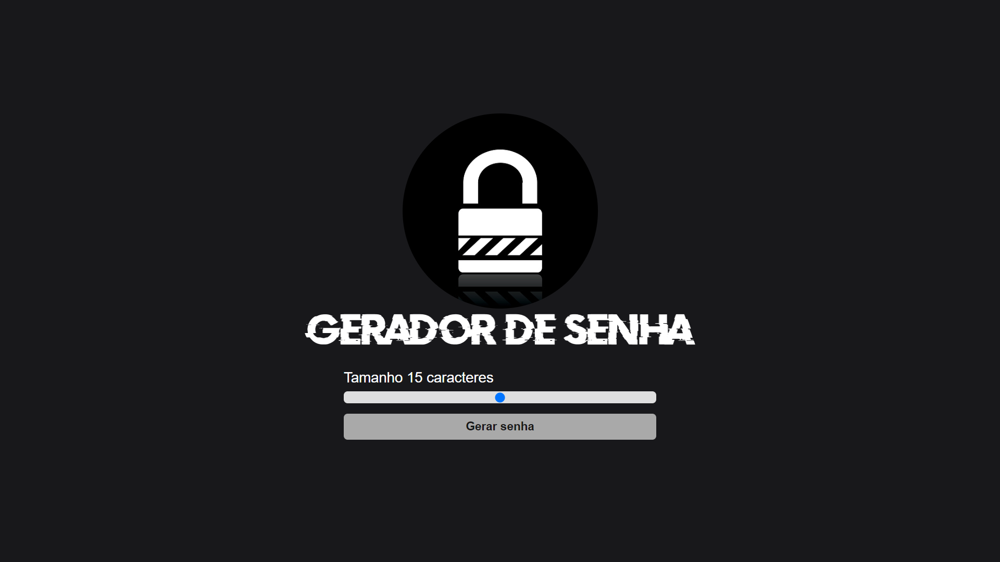
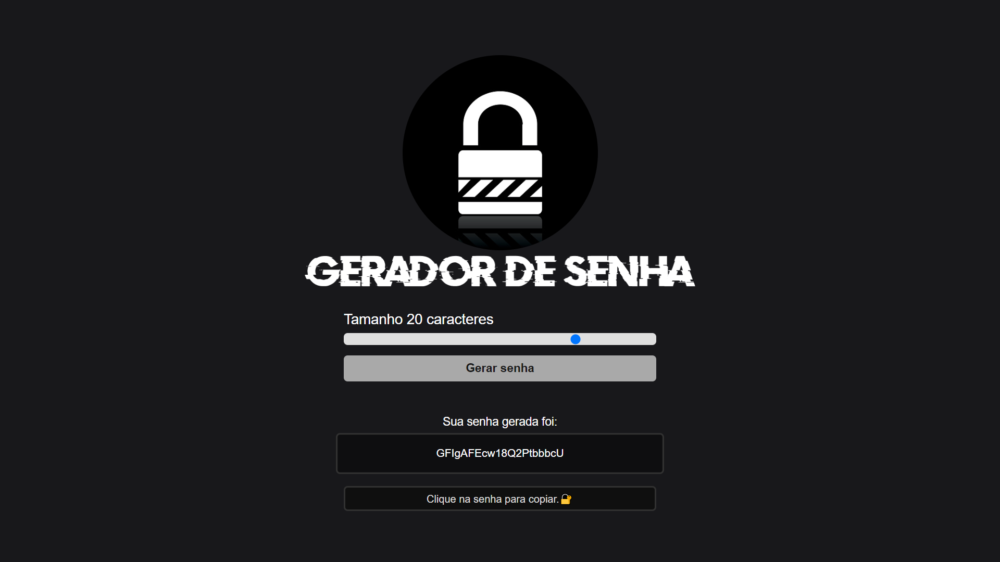
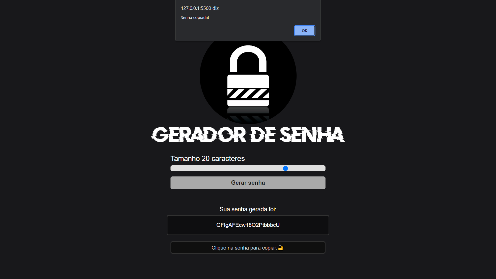

# Gerador-senhas

Esse projeto consiste em um gerador de senhas aleátorias. Nele o usuário conseguirá criar senhas em diferentes níveis de segurança usando entre 10 e 40 caracteres. A exercução desse projeto é simples, sendo necessário apenas o usuário escolher a quantidade de caracteres desejada e logo em seguida cliquar no botão "**Gerar senha**" e depois cliquar logo abaixo da frase "**Sua senha gerada foi**" para copiar rapidamente a senha criada na aplicação, em seguida é gerado um "**alert**" na tela para a confirmação da copia. Para a elaboração desse projeto foram usado conceitos básicos de html e estilização em CSS, como também lógica básica em linguagem JavaScript.

